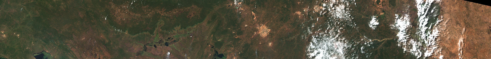

---
jupyter:
  jupytext:
    formats: ipynb,py:percent,md
    text_representation:
      extension: .md
      format_name: markdown
      format_version: '1.3'
      jupytext_version: 1.13.5
  kernelspec:
    display_name: ODC
    language: python
    name: odc
---

# Benchmarking Report

In this report we compare the performance of `odc-stac` ([GitHub](https://github.com/opendatacube/odc-stac), [Docs](https://odc-stac.readthedocs.io/en/latest/)) and `stacktac` ([GitHub](https://github.com/gjoseph92/stackstac), [Docs](https://stackstac.readthedocs.io/en/latest/)) libraries when loading Sentinel-2 COG ([Cloud Optimized GeoTIFF](https://www.cogeo.org/)) data from Azure blob storage. We analyse relative performance of the two libraries in the two common data access scenarios and measure the effect of Dask chunk-size choice on observed performance.

## Experiment Setup

Experiment was conducted in the [Planetary Computer](https://planetarycomputer.microsoft.com/) Pangeo Notebook environment, using a single-node Dask cluster with 4 cores and 32 GiB RAM per-worker.

We load three bands (red, green and blue) in the native projection and resolution of the data (10m, UTM). We consider two scenarios: **deep** (temporal processing) and **wide** (building mosaic for visualisation).

- **deep** temporal data: 2 months worth of data for a single Sentinel-2 granule
   - 3 bands, 13 time slices, 10,980x10,980 pixels each, 8.76 GiB
   - repeated with various chunk sizes
   - STAC API query
     ```json
     {
        "collections": ["sentinel-2-l2a"],
        "datetime": "2020-06/2020-07",
        "query": {
            "s2:mgrs_tile": {"eq": "35MNM"},
            "s2:nodata_pixel_percentage": {"lt": 10}
        }
     }
     ```
   - [STAC Features Deep](data/s2-ms-deep_2020-06--P2M_35MNM.geojson)
- **wide** area data: 1 day worth of data across 9 Sentinel-2 granules
   - 3 bands, 1 time slice, 10,980x90,978 pixels each, 5.58 GiB
   - repeated with various chunk sizes
   - repeated with different output resolutions (aligned to internal overview resolutions of the data)
   - STAC API query
     ```json
     {
        "collections": ["sentinel-2-l2a"],
        "datetime": "2020-06-06",
        "bbox": [27.345815, -14.98724, 27.565542, -7.710992]
     }
     ```
   - [STAC Features Wide](data/s2-ms-mosaic_2020-06-06--P1D.geojson)

To control for variability in data access performance, we run each benchmark several times and pick the fastest run for comparison. Most configurations were processed five times, with some slower ones being repeated three times. We have observed low variability of execution times for the slower ones.

A rotated thumbnail of the **wide** area scenario is displayed below, the image is actually tall and narrow - to save space we display it rotated counter clockwise.



The **deep** scenario was taken from the same region, but using only one granule (`35MNM`, left side of the image above).

```python
"""
To generate report run:

   > make
"""
import matplotlib.pyplot as plt
import pandas as pd
from IPython.display import HTML, Image

data_raw = pd.read_csv("data/benchmark-results-raw.csv")
dd = data_raw.groupby("experiment", as_index=False, group_keys=False).apply(
    lambda xx: xx[xx.elapsed == xx.elapsed.min()]
)["method scenario chunks_x elapsed submit resolution npix".split()]
dd = dd.rename(columns={"chunks_x": "chunk"})
dd["throughput_mps"] = dd.npix * 1e-6 / dd.elapsed
# dd.head()
```

## Deep Scenario Results

To investigate the impact of the configuration choices we consider several chunking sizes. When loading **deep** scenario data, we find that for both `odc-stac` and `stackstac`, chunk size of 2048 pixels produces the best result. When using optimal configuration, `stackstac` achieves a peak throughput of 121.8 output megapixels per second (Mpix/s), which is about 15% higher than `odc-stac` which peaks at 105 Mpix/s.

```python
_dd = (
    dd.loc[dd.resolution == 10]
    .loc[dd.scenario == "deep"]
    .pivot(["chunk"], ["method"], ["elapsed", "throughput_mps"])
)

fig, ax = plt.subplots(1, 2, figsize=(15, 4))
fig.suptitle("Deep Read Scenario")

_dd.elapsed.plot.barh(title="Total Time (seconds)", xlabel="Chunk Size", ax=ax[0], legend=False)
_dd.throughput_mps.plot.barh(title="Throughput (Mpix/s)", xlabel="", ax=ax[1], legend="reverse");
```

Both libraries use [GDAL](https://gdal.org/) via [rasterio](https://rasterio.readthedocs.io/en/latest/) to read the data, but `stackstac` configures GDAL internal caching to optimize the re-use of the image metadata. This has significant positive impact on performance. Essentially, caching is   only enabled when reading the image headers, so they don't get ejected by the compressed pixel data, because the compressed data is read without caching. This is especially helpful when using multiple threads in Dask workers.


## Wide Scenario Results

When loading a large mosaic however,`odc-stac` has a significant advantage over `stackstac`. For `odc-stac` optimal chunk size remains the same as for the **deep** scenario: 2048 pixels. For `stackstac`, performance slowly improves with the larger chunk sizes. The best performance for `stackstac` was achieved using the largest chunk size we tried: 7168 pixels. Throughput achieved by `odc-stac` is almost 2.5 times higher than `stackstac`: 74.7 vs 30.1 Mpix/s.

```python
_dd = (
    dd.loc[dd.resolution == 10]
    .loc[dd.scenario == "wide"]
    .pivot(["chunk"], ["method"], ["elapsed", "throughput_mps", "submit"])
)

fig, ax = plt.subplots(1, 2, figsize=(14, 4))
fig.suptitle("Wide Read Scenario")

_dd.elapsed.plot.barh(title="Total Time (seconds)", xlabel="Chunk Size", ax=ax[0], legend=False)
_dd.throughput_mps.plot.barh(title="Throughput (Mpix/s)", xlabel="", ax=ax[1], legend="reverse");
```

The approach taken by `stackstac` for loading mosaics is roughly as following:

1. Create one pixel plane for each STAC item being loaded, and stack them into one Dask Array (same as a temporal load)
2. Use Xarray and Dask to merge those layers
   ```python
   xx = stackstac.stack(items, ...)
   mosaic = xx.groupby("time").map(stackstac.mosaic)
   ```

This means that the computational complexity of the **wide** scenario grows with the number of STAC items being loaded and not just with the number of output pixels being produced. A single large area STAC Item will load significantly faster than the same area partitioned into many STAC Items.

This approach to data loading results in a very large Dask graph with a large number of "no-op" chunks. While `stackstac` includes optimizations for chunks that are "empty", those still need to be processed by the Dask scheduler, resulting in a significant processing overhead.

Approach taken by `odc-stac` avoids this problem:

1. For each output Dask chunk, figure out what data overlaps with this chunk  at the Dask graph construction time
2. For chunks that have no data, generate an "empty" task (returns array filled with `nodata` values)
3. For chunks that have only one data source, generate a "simple load" task
4. For chunks with multiple data sources, generate a "fused load" task, i.e. load data from multiple sources and, for each output pixel, pick one valid observation in the deterministic fashion (first observed non-empty pixel is used for the output).

As a result, Dask graph produced by `odc-stac` is much smaller than the graph produced by `stackstac` in this scenario. Which results in a much faster submission and processing by the Dask scheduler. The table below lists the *Submit* time in seconds, as observed for the fastest run across the chunk sizes.


```python
_dd.submit.round(3).T
```

Slow submit times are especially inconvenient in interactive data analysis workflows.

## Comparing Wide vs Deep

Both `odc-stac` and `stackstac` achieve lower throughput when constructing mosaics vs loading a column of pixel data, but the penalty is significantly higher for `stackstac`.

Sentinel-2 granules have some duplicated pixels. As a result, one needs to load several input pixels for some of the output pixels, and then combine them somehow into one (usually pick one out of the several valid candidates). In the **wide** scenario, we need to load about 1.08 input pixels for every output pixel, while for **deep** scenario input to output ratio is exactly 1. More work needs to be done per output pixel for the **wide** scenario, and so one should expect somewhat lower throughput.

```python
_dd = dd.loc[dd.resolution == 10]

fig, ax = plt.subplots(2, 1, figsize=(14, 8))
ax[0].set_title("Wide vs Deep Throughput (Mpix/s)", loc="center")
ax[0].set_title("odc-stac", loc="right")
ax[1].set_title("stackstac", loc="right")

xlim = (0, 123)
_dd.loc[dd.method == "odc-stac"].pivot(["chunk"], ["scenario"], "throughput_mps").plot.barh(
    ax=ax[0], xlabel="Chunk Size", xlim=xlim, color=["C0", "C2"], legend="reverse"
)

_dd.loc[dd.method == "stackstac"].pivot(["chunk"], ["scenario"], "throughput_mps").plot.barh(
    ax=ax[1], xlabel="Chunks Size", xlim=xlim, color=["C1", "C3"], legend="reverse"
);
```

```python
_dd.pivot(["chunk"], ["method", "scenario"], "throughput_mps").plot.bar(
    figsize=(14, 6),
    xlim=xlim,
    title="Throughput (Mpix/s)",
    ylabel="Mpix/s",
    xlabel="Chunk Size",
    color=["C0", "C1", "C2", "C3"],
);
```

For `odc-stac`, throughput for the **wide** scenario is about 30% lower than for the **deep** (74.7 vs 105 Mpix/s). From the pixel overlap cost alone, one would expect an 8% higher work requirement on the read side. The other 22% could be explained by the pixel-fusing computational requirements.

For `stackstac`, building mosaics is significantly more expensive computationally than reading temporal columns of data (30.1 vs 121.8 Mpix/s peak throughput, around 4 times slower per output pixel in **wide** scenario).

## Generating Overview Image

Loading data at significantly reduced resolutions is a common scenario. And is especially useful in the exploratory stages of the data analysis, which tend to be interactive and thus benefit from faster load times.

The cloud-optimized imagery includes low-resolution overviews, and therefore can be read much faster at lower resolutions. For every doubling of the output pixel size in ground units, one needs to load four times fewer input pixels for the same geographic area.

```python
_dd = dd.loc[dd.scenario == "wide"].loc[dd.chunk == 2048]
_dd.resolution = _dd.resolution.astype("uint32")
_dd = _dd.pivot(["resolution"], ["method"], ["elapsed", "throughput_mps"])

fig, ax = plt.subplots(1, 2, figsize=(14, 3))
fig.suptitle("Wide Read Different Resolutions (2048x2048 chunks)")

ax[0].set_title("Total Time (seconds)", loc="left")
ax[1].set_title("Throughput (Mpix/s)", loc="right")

_dd.elapsed.plot.barh(ax=ax[0], xlabel="Pixel Size (m)", legend=False)
_dd.throughput_mps.plot.barh(ax=ax[1], xlabel="", legend="reverse");
```

### Table: Performance across resolutions

```python
_dd.round(1)
```

For `odc-stac`, reading imagery at 20m pixels is 4 times faster than reading at the native 10m. Throughput per output pixel remains the same but there are four times fewer pixels to read. At the higher zoom out scales throughput starts to drop off, but load times are still getting quite a bit faster the further you zoom out.

For `stackstac`, lower resolution reads do result in faster completion time, but throughput per output pixel drops off much quicker than for `odc-stac`.

When zooming out to 1/8 image side size (1/64 in the number of pixels), `odc-stac` is more than 10 times quicker than `stackstac` (2.3 vs 29.3 seconds).


# Acknowledgements

**TODO**: some text on funding or something like that


# Appendix

- Raw results in [CSV](data/benchmark-results-raw.csv) format


## Results for 10m data load

```python
_dd = dd.loc[dd.resolution == 10].pivot(
    ["chunk"], ["method", "scenario"], ["throughput_mps", "elapsed", "submit"]
)
```

### Table: Elapsed seconds

```python
_dd.elapsed.round(1).T
```

### Table: Submit seconds

```python
_dd.submit.round(3).T
```

### Table: Throughput (Mpix/s)

```python
_dd.throughput_mps.round(1).T
```

## Results for Different Resolutions

This is for **wide** scenario only.

```python
_dd = dd.loc[dd.chunk <= 2048].loc[dd.scenario == "wide"].drop(columns=["scenario", "npix"])
_dd.resolution = _dd.resolution.astype("uint32")
_dd = _dd.pivot(["resolution"], ["method", "chunk"],  ["throughput_mps", "elapsed", "submit"])
```

### Table: Elapsed seconds, different resolutions

```python
_dd.elapsed.round(1).T
```

### Table: Submit seconds, different resolutions

```python
_dd.submit.round(3).T
```

### Table: Throughput (Mpix/s), different resolutions

```python
_dd.throughput_mps.round(1).T
```

<style>
body {
  max-width: 60em;
  margin-left: 3em;
  margin-top: 3em;
}
<style>


--------------------------------------------------------------------

```python
# a, b = 121.8, 105.0
# (a-b)/a, a*0.86-b, b*1.145
# a, b = 74.7, 30.1
# (a-b)/a, a*0.4, a/b
# a, b = 105, 74.7
# (a-b)/a, a*0.71
```
